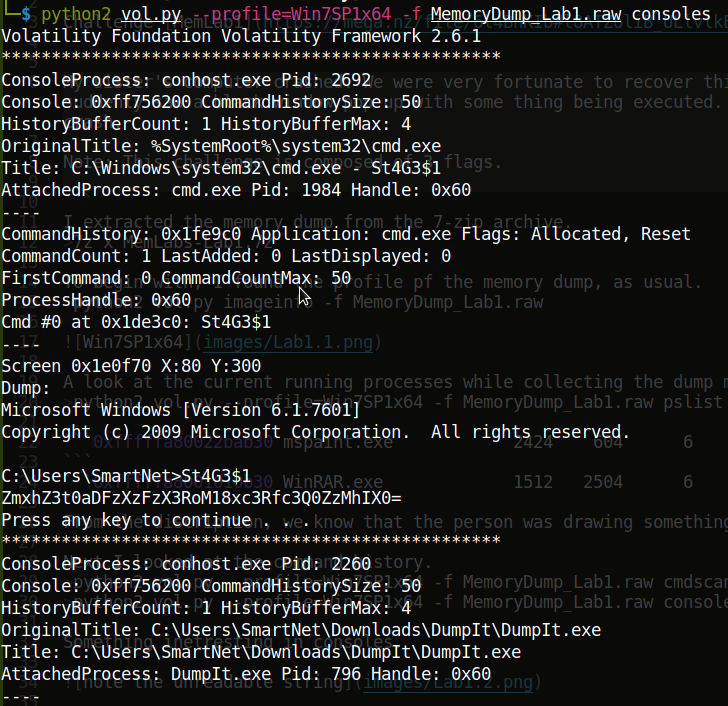

### Lab 1 -- Beginner's Luck

Challenge [MemLabs1](https://mega.nz/file/6l4BhKIb#l8ATZoliB_ULlvlkESwkPiXAETJEF7p91Gf9CWuQI70)


>My sister's computer crashed. We were very fortunate to recover this memory dump. Your job is get all her important files from the system. From what we remember, we suddenly saw a black window pop up with some thing being executed. When the crash happened, she was trying to draw something. Thats all we remember from the time of crash.
Note: This challenge is composed of 3 flags.


I extracted the memory dump from the 7-zip archive.
```7z x MemLabs-Lab1.7z```

To begin with, I found the profile pf the memory dump, as usual.
```python2 vol.py imageinfo -f MemoryDump_Lab1.raw```


A look at the current running processes while collecting the dump might give us a brief idea about what happened.
```python2 vol.py --profile=Win7SP1x64 -f MemoryDump_Lab1.raw pslist```


```0xfffffa80022bab30 mspaint.exe            2424    604      6      128      1      0 2019-12-11 14:35:14 UTC+0000
```
```0xfffffa8001010b30 WinRAR.exe             1512   2504      6      207      2      0 2019-12-11 14:37:23 UTC+0000  
```
From the discription, we know that the person was drawing something, so we can suspect mspaint.exe. Another filed that seems suspecious is WinRAR.exe.

Next I looked at the command history.
```python2 vol.py --profile=Win7SP1x64 -f MemoryDump_Lab1.raw cmdscan```
```python2 vol.py --profile=Win7SP1x64 -f MemoryDump_Lab1.raw consoles```

Something inetresting in consoles :)



We are looking for something strange, something out-of-place. On decoding this string, we get the first flag.

**flag{th1s_1s_th3_1st_st4g3!!}**

Also not the name of one user: SmartNet

I also took a look at the history of commands used in the command line.
>python2 vol.py --profile=Win7SP1x64 -f MemoryDump_Lab1.raw cmdline 

The following caught my sight.
```
mspaint.exe pid:   2424
Command line : "C:\Windows\system32\mspaint.exe" 
```
```
WinRAR.exe pid:   1512
Command line : "C:\Program Files\WinRAR\WinRAR.exe" "C:\Users\Alissa Simpson\Documents\Important.rar"
```
Note the process ID. We will need this in other commands to refer to the corresponding process. We also found another user, Alissa Simpson.

I also looked for something copied to the clipboard and the environment variables, there might be something unusual.
```python2 vol.py --profile=Win7SP1x64 -f MemoryDump_Lab1.raw clipboard```
Noting unusual here, only that which we know.
```python2 vol.py --profile=Win7SP1x64 -f MemoryDump_Lab1.raw envars```
This is a goldmine of information. We get a brief picture of the machine. But nothing very unusual caught my attention.

I then brought the file called important.rar to my local machine.
```python2 vol.py -f MemoryDump_Lab1.raw --profile=Win7SP1x64 dumpfiles -Q 0x000000003fa3ebc0 -D ./Lab1```

The file was called file.None.0xfffffa8001034450.dat. But using the file command it is clear that it is a RAR archive. So I tried to unrar it, but it's password protected. Luckily it is given that the password is the NTLM hash in uppercase of the user Alissa Simpson. So to find the password hash
```python2 vol.py -f MemoryDump_Lab1.raw --profile=Win7SP1x64 hashdump```


The third flag was in the image I got after extracting.


Now for the second flag, I need to know what that person was drawing. So I brought just the memory dump of that process to my local machine.
```python2 vol.py --profile=Win7SP1x64 -f MemoryDump_Lab1.raw memdump -p 2424 -D ./Lab1```

I need the final image, but I have just the memory dump. On some google search, I found that to get the final image, I had to rename it to .data and then adjust different parameters using gimp to get a clear picture. After playing around a little, I found someting readable.
It finally made some sense when the image type was RGB alpha and the offset:5247330, width:1230, height:9002


Thus the second flag is **flag{G00d_BOY_good_GirL_}**


