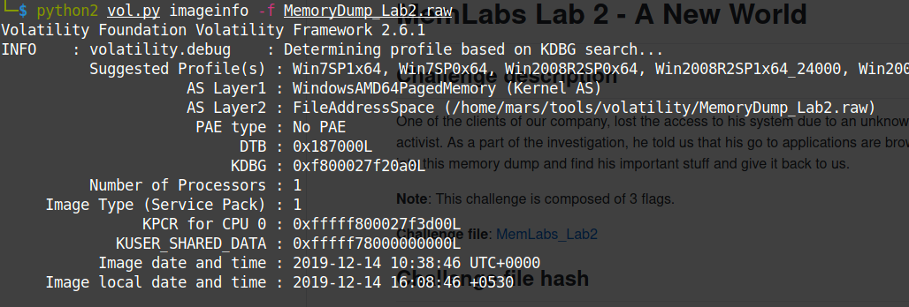
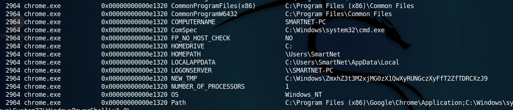
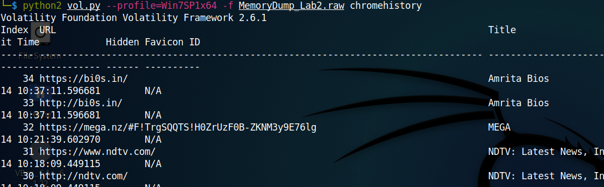
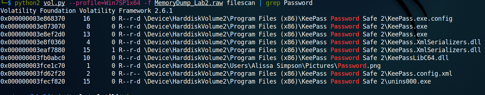
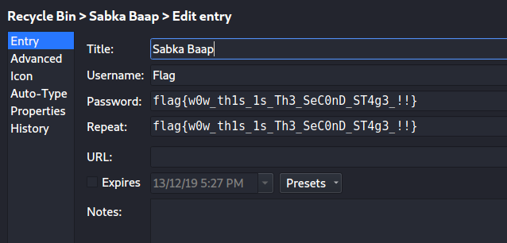

### Lab 2 -- A New World

Challenge: [MemLabs2](https://mega.nz/#!ChoDHaja!1XvuQd49c7-7kgJvPXIEAst-NXi8L3ggwienE1uoZTk)

>One of the clients of our company, lost the access to his system due to an unknown error. He is supposedly a very popular "environmental" activist. As a part of the investigation, he told us that his go to applications are browsers, his password managers etc. We hope that you can dig into this memory dump and find his important stuff and give it back to us.
Note: This challenge is composed of 3 flags.

As before, extracted the memory dump and found the profile using ```python2 vol.py imageinfo -f MemoryDump_Lab2.raw```



The profile is Win7SP1x64.

I then looked for the process that were running when the memory dump was taken.
```python2 vol.py --profile=Win7SP1x64 -f MemoryDump_Lab2.raw pslist```

Those which seemed unusual were
```0xfffffa800224a8c0 KeePass.exe            3008   1064     12      316      1      0 2019-12-14 10:37:56 UTC+0000```
```0xfffffa80011956a0 notepad.exe            3260   3180      1       61      1      0 2019-12-14 10:38:20 UTC+0000```
```
0xfffffa8002109b30 chrome.exe             2296   2664     27      658      2      0 2019-12-14 10:36:45 UTC+0000                                 
0xfffffa8001cc7a90 chrome.exe             2304   2296      8       71      2      0 2019-12-14 10:36:45 UTC+0000                                 
0xfffffa8000eea7a0 chrome.exe             2476   2296      2       55      2      0 2019-12-14 10:36:46 UTC+0000                                 
0xfffffa8000ea2b30 chrome.exe             2964   2296     13      295      2      0 2019-12-14 10:36:47 UTC+0000                                 
0xfffffa8000fae6a0 chrome.exe             2572   2296      8      177      2      0 2019-12-14 10:36:56 UTC+0000 

0xfffffa800230eb30 chrome.exe             1632   2296     14      219      2      0 2019-12-14 10:37:12 UTC+0000
```     

According to the discription, the person is an 'environmental' activist. This seems to be a hit, maybe I need to check the environment variables.
```python2 vol.py --profile=Win7SP1x64 -f MemoryDump_Lab2.raw envars```
Something interesting here. Why would anyone name a file or folder as something unreadable?!

On decoding the base64 string, we get the first lab.
**flag{w3lc0m3_T0_$T4g3_!\_Of_L4B_2}**

Also, one the person's go-to applications was his browser. Thus we need to go through this browser history.
```python2 vol.py --profile=Win7SP1x64 -f MemoryDump_Lab2.raw chromehistory ```


We found the link to [this](https://mega.nz/#F!TrgSQQTS!H0ZrUzF0B-ZKNM3y9E76lg) MEGA folder. Interesting!!!
It had a zip file, which I downloaded to my system. Trying to unzip the file, it said that the password is SHA1(stage3 flag of lab1). The required flag is flag{w3ll_3rd_stage_was_easy}. I used an [online tool](https://passwordsgenerator.net/sha1-hash-generator/) to generate the hash. '6045dd90029719a039fd2d2ebcca718439dd100a'

We found the third flag first this time also ;)
**flag{oK_So_Now_St4g3_3_is_DoNE!!}**

Remember, the person also refered to his password managers. Looked around using cmdscan, consoles, clipboard and finally found something useful at cmdline.
```
notepad.exe pid:   3260
Command line : "C:\Windows\system32\NOTEPAD.EXE" C:\Users\SmartNet\Secrets\Hidden.kdbx
```
I then did a file scan and used grep to filter the contents.
```python2 vol.py --profile=Win7SP1x64 -f MemoryDump_Lab2.raw filescan | grep kdbx```
Though it took a moment, I got an accurate result.
```0x000000003fb112a0     16      0 R--r-- \Device\HarddiskVolume2\Users\SmartNet\Secrets\Hidden.kdbx```
I then got the corresponding memory dump to my local machine.
```python2 vol.py --profile=Win7SP1x64 -f MemoryDump_Lab2.raw dumpfiles -Q 0x000000003fb112a0 -D ./Lab2```
I renamed it as hidden.kdbx and then tried to open it. I installed KeePassX in the process. But the file was password protedted. So I did another file scan this time filtering using ```python2 vol.py --profile=Win7SP1x64 -f MemoryDump_Lab2.raw filescan | grep Password ```


So I brought Password.png to my machine.
``` python2 vol.py --profile=Win7SP1x64 -f MemoryDump_Lab2.raw dumpfiles -Q 0x000000003fce1c70 -D ./Lab2```

In one corner I found the password 'P4SSw0rd_123'. I opend hidden.kdbx, eager to see the flag. Damn!!! Got rick-rolled :/
Finally in the recycle bin, I found the damn flag.

**flag{w0w_th1s_1s_Th3_SeC0nD_ST4g3_!!}**


