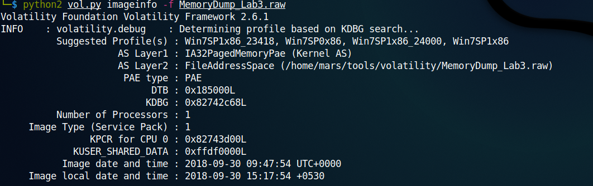

### Lab 3 -- The Evil's Den

Challenge: [MemLabs3](https://mega.nz/file/2ohlTAzL#1T5iGzhUWdn88zS1yrDJA06yUouZxC-VstzXFSRuzVg)

>A malicious script encrypted a very secret piece of information I had on my system. Can you recover the information for me please?
Note-1: This challenge is composed of only 1 flag. The flag split into 2 parts.
Note-2: You'll need the first half of the flag to get the second.
You will need this additional tool to solve the challenge,
$ sudo apt install steghide
The flag format for this lab is: inctf{s0me_l33t_Str1ng}

As usual, I extracted the memory dump and found the profile to be Win7SP1x86_23418.



Then I looked into the processes that were running, and then the process-tree.
```
0x9c6b0970 notepad.exe            3736   5300      1       60      1      0 2018-09-30 09:47:49 UTC+0000                                 
0x8443d3c0 notepad.exe            3432   5300      1       60      1      0 2018-09-30 09:47:50 UTC+0000 
```
These processes are unusual.
On using cmdscan, it looks like the malware has corrupted it.
Using cmdline, I found
```
notepad.exe pid:   3736
Command line : "C:\Windows\system32\NOTEPAD.EXE" C:\Users\hello\Desktop\evilscript.py
************************************************************************
notepad.exe pid:   3432
Command line : "C:\Windows\system32\NOTEPAD.EXE" C:\Users\hello\Desktop\vip.txt
```
Now I need to get evilscript.py and vip.txt to my local machine. So I did a filescan and then used grep to get the file offset.

```
0x000000003de1b5f0      8      0 R--rw- \Device\HarddiskVolume2\Users\hello\Desktop\evilscript.py.py
0x000000003e727e50      8      0 -W-rw- \Device\HarddiskVolume2\Users\hello\Desktop\vip.txt
```

Used the following commands to get the files to my machine.
```
python2 vol.py --profile=Win7SP1x86_23418 -f MemoryDump_Lab3.raw dumpfiles -Q 0x000000003de1b5f0 -D ./Lab3
python2 vol.py --profile=Win7SP1x86_23418 -f MemoryDump_Lab3.raw dumpfiles -Q 0x000000003e727e50 -D ./Lab3
```
Renamed the files accordingly and then found that evilscript.py was encrytping something. The encrypted data was found in vip.txt. The data was first encrypted using XOR with a key of 3 and then was base64 encoded. Reversing using [cyberchef](https://gchq.github.io/CyberChef/), I got the first half of the flag.
**inctf{0n3_h4lf**

Remember the discription, it talks about a tool called steghide. It is used to find data hidden in images(steganography). This means we need to find images. So in the filescan, using grep if looked for extensions like .jpeg, .wav, etc.

```0x0000000004f34148      2      0 RW---- \Device\HarddiskVolume2\Users\hello\Desktop\suspision1.jpeg```

So I brought this image to my machine using ```python2 vol.py --profile=Win7SP1x86_23418 -f MemoryDump_Lab3.raw dumpfiles -Q 0x0000000004f34148 -D ./Lab3``` and renamed it.


Then I extraced the hidden data using steghide. ```steghide extract -sf suspision1.jpeg```
The paraphrase was the first half of the flag. The out put was a file called 'secret text', which contained the flag.
**\_1s_n0t_3n0ugh}**

So the flag is **inctf{0n3_h4lf_1s_n0t_3n0ugh}**
