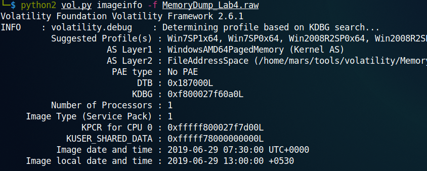
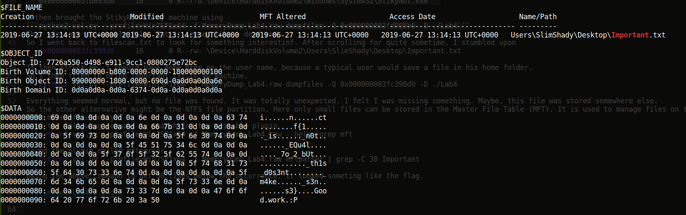

### Lab 4 -- Obsession

Challenge: [MemLabs4](https://mega.nz/file/Tx41jC5K#ifdu9DUair0sHncj5QWImJovfxixcAY-gt72mCXmYrE)

>My system was recently compromised. The Hacker stole a lot of information but he also deleted a very important file of mine. I have no idea on how to recover it. The only evidence we have, at this point of time is this memory dump. Please help me.
Note: This challenge is composed of only 1 flag.
The flag format for this lab is: inctf{s0me_l33t_Str1ng}

Again, extracted the memory dump and found the profile.



So the profile is Win7SP1x64.

Found the process that were running when the dump was taken using pslist.

```python2 vol.py --profile=Win7SP1x64 -f MemoryDump_Lab4.raw pslist```

The following were interesting.
```
0xfffffa80022f0610 GoogleCrashHan         2272   2008      7       99      0      1 2019-06-29 07:29:08 UTC+0000                                 
0xfffffa80022f6b30 GoogleCrashHan         2284   2008      7       93      0      0 2019-06-29 07:29:08 UTC+0000
0xfffffa8000f18b30 StikyNot.exe           2432   3012     10      137      2      0 2019-06-29 07:29:37 UTC+0000
```
Didn't find anything useful in cmdscan or consoles, but found the following in cmdline.
```
GoogleCrashHan pid:   2272
Command line : "C:\Program Files (x86)\Google\Update\1.3.34.11\GoogleCrashHandler.exe"
************************************************************************
GoogleCrashHan pid:   2284
Command line : "C:\Program Files (x86)\Google\Update\1.3.34.11\GoogleCrashHandler64.exe"
************************************************************************
StikyNot.exe pid:   2432
Command line : "C:\Windows\System32\StikyNot.exe" 
```
Then I did a file scan.
```python2 vol.py --profile=Win7SP1x64 -f MemoryDump_Lab4.raw filescan > ./Lab4/filescan.txt```

Then using grep I found 
```0x000000003fd095b0     10      0 R--r-d \Device\HarddiskVolume2\Windows\System32\StikyNot.exe```

I then brought the StikyNot to my machine using
```python2 vol.py --profile=Win7SP1x64 -f MemoryDump_Lab4.raw dumpfiles -Q 0x000000003fd095b0 -D ./Lab4```
That was some executable file. But it seemed like a dead end.
So I went back to filescan.txt to look for something interestinf. After scrolling for quite sometime, I stumbled upon
```0x000000003fc398d0     16      0 R--rw- \Device\HarddiskVolume2\Users\SlimShady\Desktop\Important.txt```

It then struck me, I should have done grep on the user name, because a typical user would save a file in his home folder.
So I then tried to bring Important.txt to my machine.
```python2 vol.py --profile=Win7SP1x64 -f MemoryDump_Lab4.raw dumpfiles -Q 0x000000003fc398d0 -D ./Lab4```

Everything seemed normal, but no file was found. It was totally unexpected. I felt I was missing something. Maybe, this file was stored somewhere else. 
So the other alternative might be the NTFS file partition. Here only small files can be stored in the Master File Table (MFT). It is used to manage files on the hard disk more efficiently.
Used the following command to search for the suitable plugin.
```python2 vol.py --profile=Win7SP1x64 -f MemoryDump_Lab4.raw --help |grep mft```

Found the plugin called mftparser.
```python2 vol.py --profile=Win7SP1x64 -f MemoryDump_Lab4.raw mftparser | grep -C 30 Important```

Using the above command to get 30 lines below the occurrance. It looked someting like the flag.



I then used cuberchef to decode the flag.


**inctf{1_is_n0t_EQu4l_7o_2_bUt_th1s_d0s3nt_m4ke_s3ns3}**

