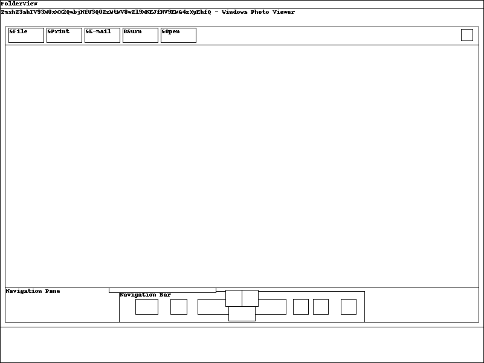

### Lab 5 -- Black Tuesday

Challenge: [MemLabs5](https://mega.nz/file/Ps5ViIqZ#UQtKmUuKUcqqtt6elP_9OJtnAbpwwMD7lVKN1iWGoec)

>We received this memory dump from our client recently. Someone accessed his system when he was not there and he found some rather strange files being accessed. Find those files and they might be useful. I quote his exact statement, "The names were not readable. They were composed of alphabets and numbers but I wasn't able to make out what exactly it was."
Also, he noticed his most loved application that he always used crashed every time he ran it. Was it a virus?
Note-1: This challenge is composed of 3 flags. If you think 2nd flag is the end, it isn't!! :P
Note-2: There was a small mistake when making this challenge. If you find any string which has the string "L4B_3_D0n3!!" in it, please change it to "L4B_5_D0n3!!" and then proceed.
Note-3: You'll get the stage 2 flag only when you have the stage 1 flag.

Again I extracted the memory dump and found the profile. It is Win7SP1x64.

Using pslist I found some wierd processes.
```
0xfffffa80010b8060 notepad.exe            2744   1580      1       57      2      0 2019-12-20 03:47:21 UTC+0000 
0xfffffa800108cb30 NOTEPAD.EXE            2724   1580      1       39      2      1 2019-12-20 03:47:53 UTC+0000 
0xfffffa8000ee8060 WerFault.exe           2716   2632      8      161      2      1 2019-12-20 03:47:54 UTC+0000                                 
0xfffffa800221ab30 NOTEPAD.EXE            1388   1580      1       39      2      1 2019-12-20 03:48:00 UTC+0000                                 
0xfffffa8000efbb30 WerFault.exe            780   2632      7      160      2      1 2019-12-20 03:48:01 UTC+0000                                 
0xfffffa8000f02b30 NOTEPAD.EXE            2056   1580      1      226 ------      1 2019-12-20 03:48:15 UTC+0000                                 
0xfffffa8000f05b30 WerFault.exe           2168   2632      7  1572864 ------      1 2019-12-20 03:48:15 UTC+0000    
```
Though I didn't find anything useful in cmdscan and consoles, I found this in cmdline.
```
WinRAR.exe pid:   2924
Command line : "C:\Program Files\WinRAR\WinRAR.exe" "C:\Users\SmartNet\Documents\SW1wb3J0YW50.rar"
************************************************************************
NOTEPAD.EXE pid:   2724
Command line : "C:\Users\SmartNet\Videos\NOTEPAD.EXE" 
WerFault.exe pid:   2716
Command line : C:\Windows\SysWOW64\WerFault.exe -u -p 2724 -s 156
************************************************************************
WerFault.exe pid:    780
Command line : C:\Windows\SysWOW64\WerFault.exe -u -p 1388 -s 156
```
I then did a file scan and grep to get the offset of the RAR archive.
```
0x000000003eed56f0      1      0 R--r-- \Device\HarddiskVolume2\Users\SmartNet\Documents\SW1wb3J0YW50.rar
```
I tried to unrar the file, but I couldn't. I need the Stage2.png. That seemed like a dead end. I went back to the discription to see if I missed anything. Looking at the various plugins, I gave the screenshot plugin a try.
```
python2 vol.py --profile=Win7SP1x64 -f MemoryDump_Lab5.raw screenshot -D ./Lab5
```
One screenshot  was interesting.



It had this base64 encoded string.  'ZmxhZ3shIV93M0xMX2QwbjNfU3Q0ZzMtMV8wZl9MNEJfM19EMG4zXyEhfQ'
On decoding, I got flag{!!_w3LL_d0n3_St4g3-1_0f_L4B_3_D0n3_!!}. Remember the discription!?

So the flag for Stage1 is **flag{!!_w3LL_d0n3_St4g3-1_0f_L4B_5_D0n3_!!}**

I then extracted the RAR archive. The following was the image.


**Flag{W1th_th1s_$taGe_2_1s_cOmPL3T3_!!}**

Remember the caution in the discription!? We need to find Stage3 flag also :)

This must probably be NOTEPAD.exe.
So I tried to get it's memory dump.
```
python2 vol.py --profile=Win7SP1x64 -f MemoryDump_Lab5.raw memdump -p 2724 -D ./Lab5
```
But the whole thing was very clumsy and I couldn't make any sense of it. So I searched for another plugin and found procdump. It dumps a process to an executable file sample (according to the offical docs).

```
python2 vol.py --profile=Win7SP1x64 -f MemoryDump_Lab5.raw procdump -p 2724 -D ./Lab5
```
A file called 'executable.2724.exe' was formed.

I used bianry ninja to see if I could find something. I'll update this when I get the flag of Stage3.
