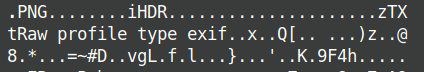

### Lab 6 -- The Reckoning

Challenge: [MemLabs6](https://mega.nz/file/C0pjUKxI#LnedePAfsJvFgD-Uaa4-f1Tu0kl5bFDzW6Mn2Ng6pnM)

>We received this memory dump from the Intelligence Bureau Department. They say this evidence might hold some secrets of the underworld gangster David Benjamin. This memory dump was taken from one of his workers whom the FBI busted earlier this week. Your job is to go through the memory dump and see if you can figure something out. FBI also says that David communicated with his workers via the internet so that might be a good place to start.
Note: This challenge is composed of 1 flag split into 2 parts.
The flag format for this lab is: inctf{s0me_l33t_Str1ng}

Again extracted the memory dump and found the profile. It is Win7SP1x64. Funny, an underworld gangster users Win7SP1x64. LOL

As usual listed all the running processes when the dump was collected.
```
python2 vol.py --profile=Win7SP1x64 -f MemoryDump_Lab6.raw pslist
```
The following were interesting.
```
0xfffffa8003227060 GoogleCrashHan         1292   1928      7      105      0      1 2019-08-19 14:40:19 UTC+0000                                 
0xfffffa8003219060 GoogleCrashHan          924   1928      6       93      0      0 2019-08-19 14:40:19 UTC+0000 
0xfffffa800234eb30 chrome.exe             2124   1944     27      662      1      0 2019-08-19 14:40:46 UTC+0000                                 
0xfffffa800234f780 chrome.exe             2132   2124      9       75      1      0 2019-08-19 14:40:46 UTC+0000                                 
0xfffffa800314fab0 chrome.exe             2168   2124      3       55      1      0 2019-08-19 14:40:49 UTC+0000        
0xfffffa80032f9a70 chrome.exe             2340   2124     12      282      1      0 2019-08-19 14:40:52 UTC+0000                                 
0xfffffa8003741b30 chrome.exe             2440   2124     13      263      1      0 2019-08-19 14:40:54 UTC+0000                                 
0xfffffa800374bb30 chrome.exe             2452   2124     14      167      1      0 2019-08-19 14:40:54 UTC+0000              
0xfffffa80032d4380 chrome.exe             2940   2124      9      172      1      0 2019-08-19 14:41:06 UTC+0000                                 
0xfffffa8003905b30 firefox.exe            2080   3060     59      970      1      1 2019-08-19 14:41:08 UTC+0000                                 
0xfffffa80021fa630 firefox.exe            2860   2080     11      210      1      1 2019-08-19 14:41:09 UTC+0000                                 
0xfffffa80013a4580 firefox.exe            3016   2080     31      413      1      1 2019-08-19 14:41:10 UTC+0000                                 
0xfffffa8001415b30 firefox.exe            2968   2080     22      323      1      1 2019-08-19 14:41:11 UTC+0000                                 
0xfffffa8001454b30 firefox.exe            3316   2080     21      307      1      1 2019-08-19 14:41:13 UTC+0000                                 
0xfffffa80035e71e0 WinRAR.exe             3716   1944      7      201      1      0 2019-08-19 14:41:43 UTC+0000
0xfffffa800157eb30 GoogleUpdate.e         2256   2396      3      118 ------      1 2019-08-19 14:42:40 UTC+0000                                 
0xfffffa80014f9060 GoogleCrashHan         1192   2256      3       46 ------      1 2019-08-19 14:42:41 UTC+0000                                 
0xfffffa80035e3700 GoogleCrashHan          864   2256      1 127...45      0      0 2019-08-19 14:42:41 UTC+0000               
```

Looking into the command line history using cmdline plugin, I found
```
WinRAR.exe pid:   3716
Command line : "C:\Program Files\WinRAR\WinRAR.exe" "C:\Users\Jaffa\Desktop\pr0t3ct3d\flag.rar"
```
and other stuff involving chrome and firefox. Maybe, we need to get the browser history.

```
python2 vol.py --profile=Win7SP1x64 -f MemoryDump_Lab6.raw chromehistory
```
Here in the middle of some random searches and other socila media links, I found a pastbin link.


https://pastebin.com/RSGSi1hk

When I opened it, I found this

```
https://www.google.com/url?q=https://docs.google.com/document/d/1lptcksPt1l_w7Y29V4o6vkEnHToAPqiCkgNNZfS9rCk/edit?usp%3Dsharing&sa=D&source=hangouts&ust=1566208765722000&usg=AFQjCNHXd6Ck6F22MNQEsxdZo21JayPKug
 
 
But David sent the key in mail.
 
The key is... :(
```

I opened the above document and found a MEGA link in the middle of nowhere.


https://mega.nz/#!SrxQxYTQ

I opened it. But I need the decryption key to get the file.

Meanwhile, I did a file scan and found this.
```
0x000000005fcfc4b0     16      0 R--rwd \Device\HarddiskVolume2\Users\Jaffa\Desktop\pr0t3ct3d\flag.rar
```
I need the passwprd for flag2.png.

Clearly, I'm missing something. I forgot to look at the firefox history.
```
python2 vol.py --profile=Win7SP1x64 -f MemoryDump_Lab6.raw firefoxhistory
```
But I found nothing. I read the note in pastbin again. I says, David sent the key in mail. So I guess I must go back to the chromehistory and look again.
I did, but without much luck. I stayed stuck for quite some time. I then thought of using strings on the memory dump. I first did grep to search for key, then drive, then Mega. I found interesting results in Mega. So I comblied the three and tried 'Mega Drive Key'. It seemed very obsfucated, but looking a little closer I gound this.


```
THE KEY IS zyWxCjCYYSEMA-hZe552qWVXiPwa5TecODbjnsscMIU
```
Finally unlocked the mega filder and downloded flag_.png. I tried to open the image, but damn! The file is corrupted.
But we have a hint. When I tried to open the file there was an error. "Fatal error reading PNG image file: zTXt: missing IHDR"


Maybe we can rectify the corrupted image. IHDR is missing. So we need to add this in the right place.
I opened the file using ghex and found this interesting error.



Thus, we need to replace 'i' with a 'I'. So I changed the respepctive ASCII values from 69 to 49. And got the fianl image. So we have the first half.


**inctf{thi5_cH4LL3Ng3_!s_g0nn4_b3_?_**

I thought the first half would unlock the second half, but I'm mistaken :/
Which means we left out something. Looking into the plugins again, I realised I missed out envars.
```
python2 vol.py --profile=Win7SP1x64 -f MemoryDump_Lab6.raw envars | grep RAR
```
Thus we found the password 'easypeasyvirus'

We extracted this image.


The second half is **aN_Am4zINg_!\_i_gU3Ss???\_}**

So the total flag is **inctf{thi5_cH4LL3Ng3_!s_g0nn4_b3_?\_aN_Am4zINg_!\_i_gU3Ss???\_}**

